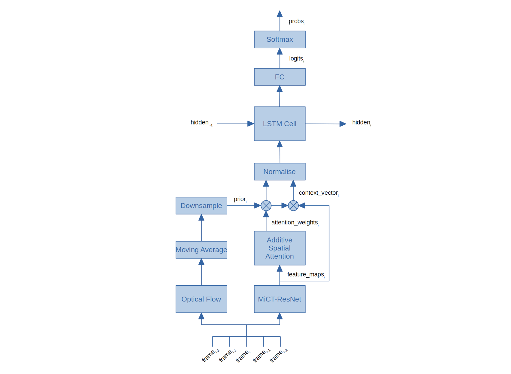

# MiCT-RANet for ASL Fingerspelling

This repository introduces MiCT-RANet, an efficient Deep Neural Network architecture for real-time recognition of ASL fingerspelled video sequences.
It achieves **74.4% letter accuracy** on the **ChicagoFSWild+** test set at **229 FPS**. MiCT-RANet is the SOTA at the time of publishing this repository, and improves the previous best performing model by a whopping 19.5%.


MiCT-RANet mainly combines research from two recent papers and adds an improved training procedure:

* [Mixed 3D/2D Convolutional Tube (MiCT) for Human Action Recognition](https://www.microsoft.com/en-us/research/uploads/prod/2018/05/Zhou_MiCT_Mixed_3D2D_CVPR_2018_paper.pdf): this CVPR'18 paper proposes to augment a 2D ConvNet backbone with a small number of parallel 3D convolutions introduced at key locations. This architecture allows the 3D convolution branches to only learn residual temporal features, which are the motion of objects and persons in videos, to complement the spatial features learned by 2D convolutions. My implementation of MiCT uses a ResNet backbone and is described in detail in this [Medium story](https://towardsdatascience.com/mict-net-for-human-action-recognition-in-videos-3a18e4f97342).

* [Fingerspelling Recognition in the Wild with Iterative Visual Attention](https://arxiv.org/pdf/1908.10546.pdf): this ICCV'19 paper introduces the ChicagoFSWild+ dataset, the largest collection to date of ASL fingerspelling videos. The team at University of Chicago achieved 62.3% letter accuracy on this recognition task using recurrent visual attention applied to the features maps of an AlexNet backbone. They developed an iterative training approach which increasingly zooms on the signing hand, thereby eliminating the need for a hand detector.

### Repository Content

This repository includes:

* Source code of the Mixed 3D/2D Convolutional Tube (MiCT-Net) built on the ResNet backbone.

* Source code of the Recurrent Visual Attention Network.

* Evaluation code for ChicagoFSWild+ to reproduce the test accuracy.

* Pre-trained weights with a ResNet34 backbone.

* A Python application to practice your fingerspelling with a webcam.

If you use it in your projects, please consider citing this repository (bibtex below).

### Notes

* A publication is under preparation. It will be made available on arXiv.
* Releasing the training code is out of the scope of this repository for the time being.
* Make sure to read and accept the license of the ChicagoFSWild and ChicagoFSWild+ data sets that were used to obtain the pre-trained weights available at the link enclosed below.


## MiCT-RANet Architecture Overview

As depicted below, the MiCT-RANet architecture combines a recurrent visual attention module with a MiCT-ResNet backbone.
The 34 layers ResNet version is used with a stride reduced to 16 in order to obtain larger feature maps for applying visual attention. This is achieved by changing the stride of the first layer of the last block from 2 to 1.
A total of five 3D convolutions are inserted along this backbone using residual connections to form so-called Mixed 3D/2D Convolutional Tubes. The depth of all 3D kernels is set to 5 to capture hand movements details along the temporal dimension.

The recurrent visual attention network (RANet) uses additive attention (also called Bahdanau attention) in combination with an LSTM cell.
The LSTM cell's hidden state and the CNN feature maps are jointly used to yield an attention map. This attention map reflects the importance of features at each spatial location for the recognition of signing sequences.
The attention map is then weighted by the magnitude of the optical flow and re-normalized. The optical flow indicates the regions in motion within the image and provides a good attention prior for locating the signing hand.
Given the small size of the features maps, it can be computed in real-time on CPU at low resolution without affecting accuracy.



The training procedure produces a model skilled for a large range of camera zoom with stable accuracy. The CTCLoss is used at train time while beam search with a beam size of 5 is used for decoding at test time. No language model was used as it yielded no performance improvements.


## ChicagoFSWild Dataset

The [ChicagoFSWild](https://ttic.uchicago.edu/~klivescu/ChicagoFSWild.htm) dataset is the first collection of American Sign Language fingerspelling data naturally occurring in online videos (ie. "in the wild"). The collection consists of two data set releases, ChicagoFSWild and ChicagoFSWild+.
Both contain short clips of fingerspelling sequences extracted from sign language videos crowd sourced from YouTube and Deaf social media. Clips were carefully annotated by experts.

The ChicagoFSWild data set contains 7304 ASL fingerspelling sequences from 160 different signers, carefully annotated by students who have studied ASL. ChicagoFSWild+ contains 55,232 sequences signed by 260 different signers.
The train, dev, and test splits were designed to obtain signer-independent subsets. The merged dataset contains respectively 303, 59 and 58 unique signers for each split. This means that the accuracy of models trained with these 3 splits is reflective of their performance with unknown signers under various conditions (eg. indoor, outdoor, studio recording, etc...).


## Performance Analysis

This section reports test results on the merged ChicagoFSWild and ChicagoFSWild+ test sets totalling 2583 samples.
The models' letter accuracy are measured with the Levenshtein distance. With a **74.4% letter accuracy MiCT-RANet-34 leads by 19.5 points and delivers 229FPS throughput** using a TITAN RTX GPU and a Core i7 6700K CPU. A single CPU core is used to calculate low resolution optical flows in real-time using Farneback's algorithm.
To fully appreciate the MiCT-RANet-34 performance, it is important to stress that the dataset is very challenging. Indeed human performance is only 86.1% and the inter-annotator agreement is about 94%. In fact many videos are noisy; they can be very compressed, or blurry, or have a too low frame rate to be fully recognizable even by human experts.
This implies that the performance of MiCT-RANet relative to a human native signer is 86.4%.


| Architecture                | Parameters  | Letter accuracy |    FPS     |
|-----------------------------|-------------|-----------------|------------|
| Iterative-Visual-Attention  | xx.xM       | 62.3            |  **xxx**   |
| MiCT-RANet-18               | xx.xM       | xx.x            |     xxx    |
| MiCT-RANet-34               | 32.2M       | **74.4**        |     229    |


Some details are missing in these tables. I intend to add them progressively. As shown below, the depth of the 3D kernels has a significant impact on the efficiency of the MiCT-RANet architecture. Harvesting 5 consecutive RGB input frames provides the best accuracy but impacts inference speed.

| 3D kernels size   | Parameters  | Letter accuracy |    FPS    |
|-------------------|-------------|-----------------|-----------|
| 3x7x7             | xx.xM       | 73.0            |    xxx    |
| 5x7x7             | 32.2M       | **74.4**        |    229    |


The errors breakdown shows that the majority of errors are deletions. This is indicative, as already explained above, that many sequences may have too low frame rates for proper recognition of all signed letters.

| MiCT-RANet-34  | Substitutions | Deletions | Insertions |
|----------------|---------------|-----------|------------|
| Error count    |          1162 |      1803 |        448 |
| Error rate     |          8.7% |     13.5% |       3.4% |
| Error share    |         34.0% |     52.8% |      13.1% |


The full confusion matrix is pretty large, so I'm including only the top-10 of the mostly confused letter pairs.

|     | letter1 | letter2 | count |
|-----|---------|---------|-------|
|  1  |    e    |    o    |  77   |
|  2  |    i    |    y    |  55   |
|  3  |    r    |    u    |  53   |
|  4  |    a    |    s    |  34   |
|  5  |    a    |    i    |  30   |
|  6  |    e    |    s    |  22   |
|  7  |    n    |    t    |  22   |
|  8  |    o    |    s    |  21   |
|  9  |    a    |    o    |  21   |
| 10  |    m    |    n    |  20   |


Regarding **word spaces** the model detects them only 15% of the time and deletes them around 74% of the time. However **there is no such thing as a space character in ASL** so it is no surprise that the model performs poorly on this detection.
Signers can use different means to indicate a word separator: they can make a short pause, or move the hand towards the right and make a pause, but very often they do nothing and just rely on their interlocutor to decode the sequence correctly.
After viewing some of those sequences, I find that many of them have no pause to indicate a word separator, but the annotators inserted one in the label to make it readable.
This annotation rule is debatable, but at least this provide a likely explanation for the poor performance on the dataset. A language model cannot help with this dataset because fingerspelling is mostly used for out of vocabulary words.

| Word spaces  | Correct | Deletion | Substitution |
|--------------|---------|----------|--------------|
| Count        |      69 |      340 |           49 |
| Share        |   15.1% |    74.2% |        10.7% |


The next table shows the accuracy as a function of the number of frames per signed letter, and we can observe that performance increases monotonically with a plateau above 81% accuracy between 6 and 13 frames per letters.
Most modern hardware support video recording in 30 FPS. This corresponds to a usage range between 2.3 and 5 letters per second for best performance, which is realistic for experienced signers.

| Frames per letter | Mean acc. | Samples |
|-------------------|-----------|---------|
|                 1 |        22 |       6 |
|                 2 |        53 |     146 |
|                 3 |        66 |     289 |
|                 4 |        73 |     593 |
|                 5 |        77 |     392 |
|                 6 |        81 |     432 |
|                 7 |        82 |     205 |
|                 8 |        83 |     181 |
|                 9 |        81 |      88 |
|                10 |        81 |      95 |
|                11 |        82 |      43 |
|                12 |        86 |      27 |
|                13 |        84 |      21 |
|                14 |        76 |      23 |
|               15+ |        69 |      42 |


## Testing on Your Own
I'm providing below the link to the pre-trained weights to easily reproduce the above results and run the fingerspelling practice application included in this repository.
Note that as already mentioned above, releasing the training code is out of the scope of this repository for the time being.


| Architecture                                                                    | Parameters  | Letter accuracy |
|---------------------------------------------------------------------------------|-------------|-----------------|
| [MiCT-RANet34](https://1drv.ms/u/s!AvyZUg7UPo_CgdN4QBbq4I85Cl25Ww?e=KY07YI)     | 32.2M       | **74.4**        |

You can test the model directly from the command line as such:

```
$ python test.py --conf.ini
Compute device: cuda
2583 test samples
Loading weights from: data/MiCT-RANet34.pth
Total number of encoder parameters: 32164128
Mean sample running time: 0.123 sec
229.2 FPS
Letter accuracy: 74.38% @ scale 2
```


## Fingerspelling Practice App

A real-time fingerspelling interpreter is included in this repository. You can use it to practice your fingerspelling and evaluate MiCT-RANet's capabilities using a webcam or a smartphone connected to your computer.
Before trying the application, I recommend that you first read the performance analysis described above, so that you understand what to expect and where the calibration comes from.
The quality of your experience will depend on your hardware performance, your ability to calibrate the application using the provided parameters, and your fingerspelling skills.

**This application is provided as-is. It is not a product ! I will not provide support, nor respond to troubleshooting requests, or teach fingerspelling !**

I cannot advise what are the minimum hardware requirements. These are my measured frame rates as a function of the number of input frames (see optional argument `frames_window`) used to make a frame prediction. The CPU is a Core i7 6700K.
The 2080 Ti and Titan RTX have very close performance. The highest GPU throughput is obtained with batches of 21 frames: the Titan can process 12.1 batches per second, or the equivalent of 254 FPS.

| Video card \ window  |  9 frames  |  13 frames  |  17 frames  |  21 frames  |
|----------------------|------------|-------------|-------------|-------------|
| NVIDIA 2080 Ti       |    17.9    |     14.8    |     13.0    |     11.8    |
| NVIDIA Titan RTX     |    19.5    |     16.5    |     13.3    |     12.1    |

### Usage and Calibration Tips
* **The application predicts the signed letter when you transition to the next one.** This means that it is useless to hold your hand and wait for the detection because nothing will happen until you start moving your fingers to make the next letter. It can be confusing at the beginning and takes some time to get used to the lag.
* **It is desirable to sign fast because the model was trained with and for expert signers.** The dataset has 6 frames per letter on average. There is no need to aim for 30FPS or even 24 unless you are an expert signer who can sign 4 letters per second.
* **Be patient if you are learning fingerspelling** as the model was not made to be used by beginners. The application can still do okay if you sign slowly, but you will get more unexpected letter insertions. For example, if you transition from letter B to O, the model might insert a C in between and there is nothing wrong with that. It means that you need to sign faster or reduce the frame rate. Use the `skip_frames` optional parameter to down sample your camera’s frame rate.
* **The model was not trained to predict long English sentences.** The dataset has only 5.1 letters per video sample on average and ASL signers use fingerspelling for out of vocabulary words, so the dataset is the opposite to that purpose.
* **All letters have gesture variations** and the model does not recognize them equally well. You may have to adapt your signing style to the application's capabilities to obtain the desired results.
* **Enable auto-focus and block exposure** and other automatic image adjustments as it may degrade performance by adding noise to the optical flow.
* **Position yourself at the right distance from the camera:** check the animations on this page for instructions and use your camera’s built-in zoom if needed.
* **Lightning must not be neglected:** your hand and face should not be casting shadows. A direct light facing you will help and three-point lightning is the ideal setup.


### Running the Application
To start the application with the default parameters simply run the following command:

```
$ python webcam.py
```

**The main optional arguments are:**
* **frames_window:** the number of frames used to make each prediction. The possible values are 9, 13, 17 and 21. Larger windows provide higher performance but increase the lag and require better signing skills: if you make a very small pause with a large window, the model may insert a space you've not asked for.
* **flows_window:** the number of optical flows used to calculate an attention prior map. The default value is 5 and should not be changed.
* **skip_frames:** controls the down-sampling factor applied to the webcam. For example using a value of 3 on a 30FPS camera will reduce the frame rate to 10. Beginners may get started with 10 or 12FPS. More advanced users may want to target 15 to 18FPS. The higher the frame rate, the more invalid letter insertions. The default value is 2.

**Commands**
* Press the `Delete` key to clear all letters.
* Press the `Enter` key to start a new line.
* Press the `Space` key to insert a space character. This is cheating but provided for convenience.
* Press the `Backspace` key to delete the last letter (this is also cheating !).
* Press the `r` key to start or stop recording. Each recording sequence will be saved in a new folder.
* Press the `Escape`, `q` or `x` key to exit the application.


## Future Work

* **Optimizations:** it is possible to get higher frame rates at the cost of an increased lag.
* **NLP enhancements:** the experience could benefit from a spell-checker and a language model for signing full English phrases.
* **Noise reduction:** apply methods to identify noisy labels and either correct them or progressively remove the noisy samples during training.
* **Increase model complexity:** add more 3D kernels and/or pseudo-3D kernels, use deeper 3D kernels capable of processing 7 images or more, bi-directional LSTM.


## Requirements
CUDA 10.1, Python 3.6, Torch 1.4, and OpenCV 4.1.1.

The following Conda commands worked for me to setup the environment:

```
conda create -n torchcv python=3.6
conda install -c pytorch pytorch torchvision cudatoolkit=10.1 numpy scipy pandas matplotlib cython unidecode
conda install -c conda-forge opencv=4.1.1
```

You need a **high quality camera** because low quality hardware produce noisy pixels that affect the quality of the optical flow. Most smartphones have high quality video recording capabilities. To use an Android phone as webcam you can install **DroidCamX Pro** to transfer the video stream to your PC using a USB cable. More information can be found by following this [link](http://www.dev47apps.com/).


## Citation
Use this bibtex to cite this repository:
```
@misc{fmahoudeau_mictranet_2020,
  title={MiCT-RANet for real-time ASL fingerspelling video recognition},
  author={Florent Mahoudeau},
  year={2020},
  publisher={GitHub},
  journal={GitHub repository},
  howpublished={\url{https://github.com/fmahoudeau/MiCT-RANet-ASL-FingerSpelling}},
}
